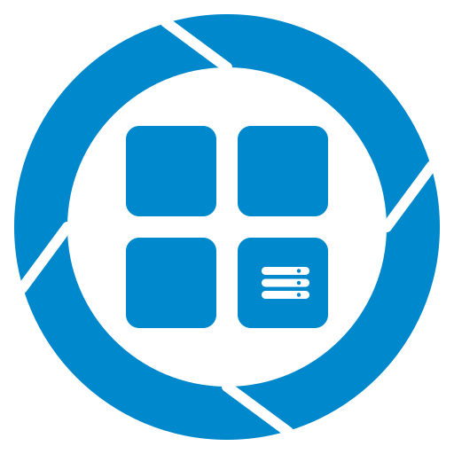

<p align="center">
  
</p>

# yi-nvr

**Un ecosistema NVR gratuito y autoalojado para cámaras [yi-hack](https://github.com/roleoroleo/yi-hack-Allwinner-v2): la alternativa libre al ecosistema cerrado de Xiaomi / Yi / MiHome.**

Toma el control total de tu videovigilancia: gestiona varias cámaras, graba clips por detección de movimiento, visualiza en directo desde el navegador y recibe alertas instantáneas. Sin cuentas, sin dependencia de la nube y sin suscripciones. Solo tus cámaras, tu almacenamiento y tus reglas.

> **Despliegue en segundos:** clona el repositorio, copia el archivo `.env` y ejecuta `npm start` dentro de `apps/api`. Tendrás el sistema listo en **http://localhost:3000** en cuestión de un minuto.

---

## Inicio rápido

Todo el sistema funciona como un único proceso de Node.js en un solo puerto — sin servidores web independientes ni nginx.

> **Compila el frontend primero.** El panel de control comparte el puerto de la API (`3000`), pero requiere compilar la PWA de Angular una primera vez; de lo contrario, `http://localhost:3000` devolverá un error 404. Ejecuta `npm run build:web` en `apps/frontend` antes de arrancar el backend:

```bash
# 1. Compila la PWA de Angular (la API la servirá como archivos estáticos)
cd apps/frontend && npm install && npm run build:web

# 2. Copia la plantilla de variables de entorno (solo la primera vez)
cp .env.example .env

# 3. Arranca el backend (API REST + PWA estática en http://localhost:3000)
cd apps/api && npm install && npm start

```

Abre **http://localhost:3000** para acceder al panel de control.

Los dos modos de ejecución local — **producción** (compilación única servida por la API) y **desarrollo** (`ng serve` con proxy hacia la API) — se explican en detalle en los README técnicos más abajo.

### Configuración de cámaras

El archivo `infra/cameras.json` es la única fuente de verdad para el backend (IPs locales, directorio FTP y temas MQTT). Está **ignorado en git**, por lo que debes introducir tus datos reales antes de conectar cualquier cámara.

---

## Características principales

* **Gestión de cámaras** — Estado, eventos, emisión en directo y configuración de cada cámara mediante MQTT.
* **Grabación por detección de movimiento** — Las cámaras envían clips cortos en `.mp4` por FTP; cada uno genera una miniatura JPG y una vista previa animada en WebP, se indexa en SQLite y se sirve mediante la API y la PWA.
* **Vista en directo en el navegador** — WebRTC en tiempo real mediante el sidecar `go2rtc` (con soporte de reserva para MSE/mp4) y proxy integrado en el propio proceso. Sin necesidad de extensiones.
* **Notificaciones Web Push** — Recibe alertas de movimiento y avisos de procesamiento finalizado directamente en el navegador.
* **PWA optimizada para móviles** — Panel de control, controles de cámara, galería de clips, línea de tiempo y ajustes en una sola aplicación instalable.
* **Retención y control de disco** — Políticas de limpieza por antigüedad y capacidad para mantener un uso de almacenamiento predecible.
* **Ligero y flexible** — Diseñado para funcionar en mini PCs o placas ARM sencillas (Orange Pi y similares) tras una VPN Tailscale/Headscale.

---

## Cómo funciona

Los datos fluyen a través de un pipeline sencillo y lineal:

```
Camera ──FTP clips──▶ FTP receiver ──▶ ffmpeg processing
                                               │
                                         thumbnail + preview
                                               │
                                         SQLite index
                                               │
 REST API ◀───────────────────────────────────┘
    ▲
    │ MQTT (motion, LED, IR-cut, record mode, power)
 Camera ◀─────────────────────────────── control plane
    ▲
    │ WebRTC / MSE (live view)
 Browser ◀──────────────────────────────────────── go2rtc sidecar

```

1. La **cámara** detecta movimiento y sube un clip corto por FTP.
2. El **receptor FTP** recoge el archivo bruto y `ffmpeg` genera la miniatura junto con la vista previa animada.
3. El resultado se guarda en SQLite y se expone mediante la **API REST**.
4. La **PWA de Angular** consulta estos datos para mostrar el estado, las galerías y la línea de tiempo.
5. **MQTT** gestiona los eventos de movimiento y los comandos de control (LED, visión nocturna, modo de grabación, encendido) entre el NVR y cada cámara.
6. **Web Push** envía las alertas en tiempo real al navegador.

Para conocer todos los detalles —elección de tecnologías, variables de entorno y decisiones de diseño— consulta [`docs/ARCHITECTURE.md`](docs/ARCHITECTURE.md).

---

## Stack tecnológico

| Capa | Tecnología |
| --- | --- |
| Backend | Node.js (LTS 20+), Express 5 |
| Base de datos | SQLite mediante `better-sqlite3` |
| Receptor FTP | `ftp-srv` + `chokidar` |
| Procesamiento de vídeo | `fluent-ffmpeg` + binario `ffmpeg` del sistema |
| Plano de control MQTT | Eclipse Mosquitto 2 (Docker) |
| RTSP → WebRTC | Sidecar `go2rtc`, proxy integrado |
| Notificaciones Push | `web-push` (VAPID) |
| Frontend | PWA en Angular 22 (con service worker) |
| Despliegue | Docker Compose (soporte para systemd en dispositivos con poca RAM) |

---

## Despliegue

Para entornos de producción se recomienda utilizar Docker Compose. **No es necesario clonar el repositorio completo**: basta con descargar el archivo `docker-compose.yml` y las plantillas `.example`, ajustarlas a tu entorno y arrancar el servicio:

```bash
# 1. Descarga docker-compose.yml
curl -o docker-compose.yml https://raw.githubusercontent.com/ricardoeplaza/yi-nvr/master/docker-compose.yml

# 2. Descarga las plantillas de configuración
curl -o .env.example      https://raw.githubusercontent.com/ricardoeplaza/yi-nvr/master/.env.example
curl -o infra/cameras.json.example   https://raw.githubusercontent.com/ricardoeplaza/yi-nvr/master/infra/cameras.json.example
curl -o infra/go2rtc/go2rtc.yaml.example https://raw.githubusercontent.com/ricardoeplaza/yi-nvr/master/infra/go2rtc/go2rtc.yaml.example
curl -o infra/mosquitto/mosquitto.conf.example https://raw.githubusercontent.com/ricardoeplaza/yi-nvr/master/infra/mosquitto/mosquitto.conf.example

# 3. Edita los archivos con tu configuración
cp .env.example .env          # Configura NVR_PUBLIC_IP, claves VAPID y API_AUTH_TOKEN
cp infra/cameras.json.example infra/cameras.json   # Añade tus cámaras
cp infra/go2rtc/go2rtc.yaml.example infra/go2rtc/go2rtc.yaml   # Define un stream RTSP por cámara
cp infra/mosquitto/mosquitto.conf.example infra/mosquitto/mosquitto.conf

# 4. Inicia el sistema (descarga la última imagen y arranca la API, Mosquitto y go2rtc)
docker compose up -d

```

> Las plantillas `.example` se encuentran en `infra/`, `infra/go2rtc/` y `infra/mosquitto/`. Si prefieres clonar el repositorio completo, puedes hacerlo con: `git clone https://github.com/ricardoeplaza/yi-nvr.git && cd yi-nvr`.

**Puertos expuestos**

| Puerto | Uso |
| --- | --- |
| `3000` | API HTTP + PWA estática + archivos multimedia + proxy de streaming |
| `21` + `1024–1027` | Servicio FTP (recepción de vídeo desde las cámaras, rango pasivo) |
| `1883` | Broker Mosquitto (conexión local de las cámaras) |

> El puerto `21` es un puerto privilegiado, por lo que el contenedor se ejecuta como root por defecto. Si prefieres evitar puertos privilegiados, cambia `FTP_PORT` en el archivo `.env` y actualiza la ruta en el script `ftppush.sh` de la tarjeta SD de la cámara.

**Estructura del almacenamiento** — Los datos se guardan fuera del directorio de código fuente, tanto en desarrollo como en Docker:

| Directorio | Uso | Medio recomendado |
| --- | --- | --- |
| `./data/` | Base de datos SQLite + archivos procesados (miniaturas y vistas previas) | SSD |
| `./incoming/` | Recepción FTP: subidas en bruto de las cámaras (directorio monitorizado) | tmpfs / HDD |
| `./recordings/` | Copia local de los clips procesados (servidos en `/videos`) | HDD |

**Copia de seguridad 3-2-1 opcional:** Activa `REMOTE_MIRROR=1` y monta un almacenamiento remoto (NFS o rclone) en la carpeta `remote_recordings`. Cada clip procesado se replicará allí automáticamente. En caso de fallo en la red o en el almacenamiento remoto, el sistema reintentará la copia sin interrumpir el flujo principal.

---

## API para desarrolladores

El backend expone una API REST en el mismo puerto que el panel de control (`http://localhost:3000`). Puntos de entrada principales:

| Método | Endpoint | Uso |
| --- | --- | --- |
| `GET` | `/api/health` | Estado del servicio (BD, FTP, MQTT) |
| `GET` | `/api/videos` | Lista de clips (filtros: `camera`, `startDate`, `endDate`, `q`, `favorite`, `limit`) |
| `GET` | `/api/videos/:id` | Detalle de un clip |
| `PATCH` | `/api/videos/:id` | Renombrar un clip |
| `POST` | `/api/videos/:id/favorite` | Marcar o desmarcar como favorito |
| `DELETE` | `/api/videos/:id` | Eliminar un clip y sus archivos asociados |
| `GET` | `/api/cameras` | Lista de cámaras registradas y su estado |
| `POST` | `/api/cameras/:id/reload` | Recargar la configuración de cámaras en caliente |
| `POST` | `/api/cameras/:id/{power,led,night-vision,rec-mode}` | Enviar comandos de control a la cámara |
| `GET` | `/api/cameras/:id/stream` | Endpoints para streaming WebRTC/MSE |
| `POST` | `/api/push/subscribe` | Registrar suscripción a notificaciones Web Push |

La implementación completa se encuentra en [`apps/api/src/server.js`](apps/api/src/server.js) y en sus respectivas rutas dentro de `apps/api/src/routes/`.

---

## Enlaces de interés

* **Frontend (PWA de Angular)** — [`apps/frontend/README.md`](apps/frontend/README.md)
* **Detalles del backend** — [`apps/api/src/server.js`](apps/api/src/server.js) y `apps/api/src/routes/`
* **Arquitectura y diseño** — [`docs/ARCHITECTURE.md`](docs/ARCHITECTURE.md)
* **Referencia CGI para cámaras** — [`docs/CAMERA-CGI-REFERENCE.md`](docs/CAMERA-CGI-REFERENCE.md)
* **Configuración del firmware en SD** — [`docs/SD-FIRMWARE-OFFICIAL-SETTINGS.md`](docs/SD-FIRMWARE-OFFICIAL-SETTINGS.md)

---

## Estado del proyecto

El desarrollo se realiza por fases etiquetadas en git, cada una con sus propios criterios de aceptación. La etiqueta actual indica el punto exacto de avance. Puedes consultar la hoja de ruta en [`AGENT-PLAN.md`](AGENT-PLAN.md).

---

## Agradecimientos

* **[roleoroleo](https://github.com/roleoroleo?utm_source=gemini)** — Creador de [yi-hack-Allwinner-v2](https://github.com/roleoroleo/yi-hack-Allwinner-v2?utm_source=gemini), el firmware libre que habilita MQTT, RTSP y FTP en estas cámaras y hace posible este proyecto.
* A toda la comunidad detrás de proyectos como `go2rtc`, `Mosquitto`, `better-sqlite3`, `ffmpeg` y el resto del stack.

---

## Licencia

[ISC](https://opensource.org/licenses/ISC?utm_source=gemini) — Libre uso, modificación y distribución.

---

## Desarrollado íntegramente con modelos abiertos en local

Este código ha sido generado utilizando **Qwen 27B** ejecutándose **de forma 100% local en una GPU de 16 GB**, sin recurrir a APIs en la nube ni modelos propietarios. Este enfoque es un pilar fundamental del proyecto: demuestra de forma práctica que es posible construir software listo para producción utilizando modelos abiertos en hardware de consumo.

El proceso ha contado con supervisión humana en cada etapa:

* Una **fase de planificación detallada** documentada en [`AGENT-PLAN.md`](AGENT-PLAN.md), que define la arquitectura, las tecnologías y las fases de desarrollo.
* **Revisión y validación continua**, verificando y aprobando cada commit de forma manual.

El resultado es un sistema NVR completo que reemplaza la dependencia de la nube del ecosistema Xiaomi, desarrollado y probado en hardware accesible.